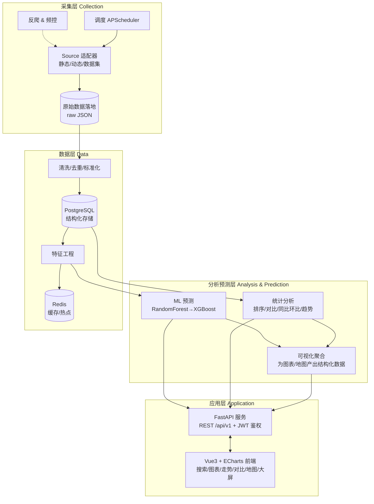
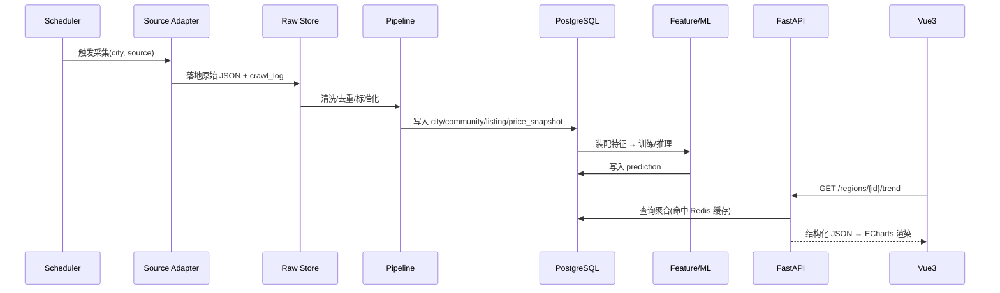

# 技术设计 - 城市房价分析系统

> 本文件是 Trellis 执行用的技术设计概要，给出边界、契约、数据流与关键权衡。
> **详细规格（可直接开发的细节）在项目根 `docs/` 文档集**，本文交叉引用而不重复维护。

## 1. 架构总览（四层）

自底向上：采集层抓原始网页/数据集 → 数据层清洗入库并做特征 → 分析预测层做统计与 ML → 应用层通过 FastAPI 暴露 REST，前端消费并可视化。**采集与分析/查询解耦**：采集挂掉不影响既有数据的查询。

详见 `docs/02-系统架构设计.md`。

## 2. 模块边界与职责

| 模块 | 目录（规划） | 职责 | 关键依赖 |
|------|------|------|---------|
| collector | `backend/app/collector/` | 调度、Source 适配器、反爬、原始落地 | requests, lxml, playwright, apscheduler |
| pipeline | `backend/app/pipeline/` | 清洗、去重、标准化、入库、特征工程 | pandas, sqlalchemy, alembic |
| analytics | `backend/app/analytics/` | 排行、对比、趋势、同比环比、聚合 | pandas, numpy |
| ml | `backend/app/ml/` | 特征装配、训练、评估、推理、模型版本化 | scikit-learn, xgboost, joblib |
| api | `backend/app/api/` | REST 路由、依赖注入、鉴权、序列化 | fastapi, pydantic v2, python-jose |
| core | `backend/app/core/` | 配置、DB 会话、缓存、日志、安全 | pydantic-settings, redis |
| frontend | `frontend/` | 页面、组件、图表、地图、状态管理 | vue3, vite, ts, element-plus, echarts, pinia |

## 3. 数据契约（核心，单一事实源见 docs/04、docs/05）

### 3.1 领域术语（统一术语表，详见 docs/02 附录）
city（城市，拼音缩写 code）> district（区县）> area（街镇/板块）> community（小区）> listing（房源）。
时序度量：`price_snapshot`（year_month 维度的均价快照，含供给价/关注价/价值价三口径）。

### 3.2 核心数据表（详见 docs/04，含 ER 图与建表语句）
`city` / `district` / `community` / `listing` / `price_snapshot` / `price_distribution` / `prediction` / `user` / `crawl_job` / `crawl_log`。

### 3.3 REST API（详见 docs/05，含完整请求/响应示例）
统一前缀 `/api/v1`。代表性端点：
- 元数据：`GET /cities`、`GET /cities/{code}/districts`
- 行情：`GET /regions/{id}/price`、`GET /regions/{id}/trend`、`GET /regions/{id}/distribution`
- 排行/对比：`GET /rank`、`GET /compare`
- 地图：`GET /map/heat`
- 预测：`GET /predict/{regionId}`、`POST /admin/predict/train`
- 鉴权：`POST /auth/login`、`POST /auth/register`、`GET /auth/me`
- 采集管理：`POST /admin/crawl/trigger`、`GET /admin/crawl/jobs`

## 4. 关键数据流

## 5. 关键技术权衡

| 决策点 | 选择 | 理由 | 备选/可替换 |
|-------|------|------|-----------|
| 数据主力源 | creprice.cn | SSR 直出、反爬弱、含历史时序 | 中介站仅演示 |
| 动态页采集 | Playwright | 现代、比 Selenium 稳、可复用调研脚本 | Selenium |
| 后端框架 | FastAPI | 异步、OpenAPI、与 ML 同生态 | Django+DRF |
| 数据库 | PostgreSQL 16 | 窗口函数利于时序/同环比、JSON 字段 | MySQL 8 |
| ORM | SQLAlchemy 2.0 (async) + Alembic | 成熟、迁移可控 | Tortoise |
| 缓存/调度 | Redis + APScheduler | 轻量，够用；不引入 Celery 降复杂度 | Celery+broker |
| ML baseline | RandomForest | 稳、无需大量调参即达标 | 线性回归兜底 |
| ML 提升项 | XGBoost | 精度亮点 | LightGBM |
| 前端 | Vue3+ECharts | 中文生态成熟、地图离线 GeoJSON | React+AntD |

## 6. 角色与权限（RBAC）

| 角色 | 权限 |
|------|------|
| 游客 guest | 基础搜索、城市/区域均价、柱状图、单区域走势 |
| 注册用户 user | 以上 + 多区域对比、跨城对比、地图、预测结果查看、收藏 |
| 管理员 admin | 以上 + 触发/管理采集任务、训练/切换模型、数据与用户管理 |

JWT（access + 可选 refresh），路由依赖注入校验角色。详见 docs/05。

## 7. 兼容性、回滚与风险

- **站点结构漂移**：适配器字段映射配置化（YAML/常量），解析失败降级并记录 `crawl_log`，不污染已入库数据。
- **反爬升级**：中介站抓取失败自动跳过，不阻塞主力源；主力源频控 + 随机延时 + UA 轮换。
- **数据不足以训练**：先用公开数据集训练验证链路，真实时序增量积累；预测端点在样本不足时返回置信区间放宽或"数据积累中"。
- **回滚**：数据库迁移可回退（Alembic downgrade）；模型按版本保存，切换即回滚；前后端独立部署可分别回滚镜像。

## 8. 里程碑（对应 implement.md 与 docs/08）

- M1（第 1 月）：脚手架 + 采集(creprice) + 清洗入库 + 基础查询/柱状图/走势。
- M2（第 2–3 月）：对比 + 地图 + 角色权限 + 预测链路(RF)。
- M3（3 月后）：XGBoost 调优 + 可视化大屏 + 系统测试与部署。

## 9. 交付文档索引（docs/）

见 `docs/README.md`。本设计文件为执行视角概要，细节以 docs/ 为准。
