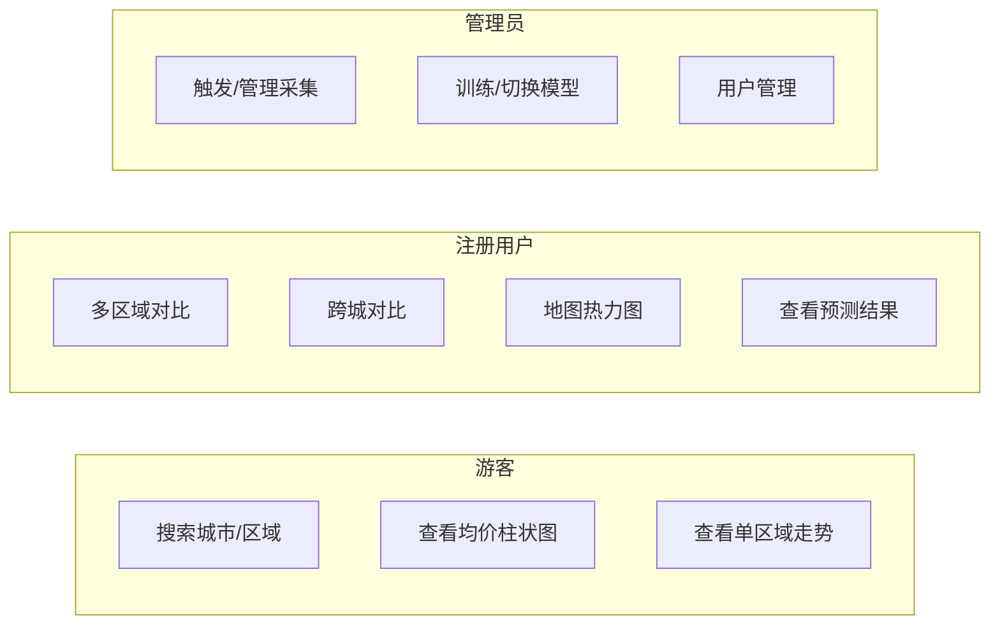

# 01 · 需求规格说明

> 本文档为**城市房价分析系统**的功能与非功能需求规格，构成开发验收的判定依据。

## 1. 产品背景

城市化进程加速，房价数据碎片化、不透明，普通用户与决策者难以获取结构化的区域房价走势与预测。本系统通过**多源数据采集 → 清洗入库 → 统计分析 → 机器学习预测 → 可视化呈现**全链路，为用户提供城市/区县/板块三级粒度的房价分析能力。

## 2. 用户角色

| 角色 | 说明 |
|------|------|
| 游客 guest | 未登录用户，可使用基础搜索与浏览 |
| 注册用户 user | 已登录用户，解锁对比、地图、预测等高级功能 |
| 管理员 admin | 运维角色，管理采集任务、模型训练与用户 |

## 3. 功能需求

### 3.1 数据采集（采集层）

| 编号 | 功能 | 描述 | 优先级 |
|------|------|------|--------|
| F-C01 | 静态源采集 | 从 creprice.cn 采集城市/区县级月度均价时序（供给价/关注价/价值价）、价格区间分布 | P0 |
| F-C02 | 动态源采集 | 从链家/安居客采集小区/房源明细（演示级，小样本低频） | P1 |
| F-C03 | 数据集导入 | 支持导入 Kaggle House Prices 等公开数据集作为 ML 训练底座 | P1 |
| F-C04 | 采集调度 | APScheduler 定时/手动触发采集任务，支持按城市/数据源粒度调度 | P0 |
| F-C05 | 采集监控 | 记录每次采集的 URL、状态码、成功/失败、耗时、记录数，可在管理端查看 | P0 |

### 3.2 数据处理（数据层）

| 编号 | 功能 | 描述 | 优先级 |
|------|------|------|--------|
| F-D01 | 数据清洗 | 去除无效/异常记录，标准化字段格式（价格单位、面积单位、日期格式） | P0 |
| F-D02 | 去重 | 基于（数据源+源ID）或（区域+时间）维度去重，防止重复入库 | P0 |
| F-D03 | 标准化入库 | 将不同数据源的异构数据映射为统一 schema 写入 PostgreSQL | P0 |
| F-D04 | 特征工程 | 为 ML 模型装配特征（滞后价格、滚动均值、同比环比、区域编码等） | P1 |

### 3.3 分析与预测（分析预测层）

| 编号 | 功能 | 描述 | 优先级 |
|------|------|------|--------|
| F-A01 | 均价查询 | 查询指定区域最新/历史均价（供给/关注/价值三口径） | P0 |
| F-A02 | 走势分析 | 展示区域房价月度走势折线图（可选时间范围） | P0 |
| F-A03 | 排行榜 | 按均价对城市/区县/板块排序，支持升降序、分页 | P0 |
| F-A04 | 多区域对比 | 支持 2~5 个区域的价格走势叠加对比 | P1 |
| F-A05 | 同比环比 | 计算并展示同比（YoY）与环比（MoM）变化率 | P1 |
| F-A06 | 价格分布 | 展示区域内价格区间占比分布（饼图/柱状图） | P1 |
| F-A07 | 地图热力 | 在地图上按区域着色展示房价高低，支持缩放与点击下钻 | P1 |
| F-A08 | ML 预测 | 基于历史时序预测未来 N 月均价，展示预测值与置信区间 | P1 |

### 3.4 用户与权限

| 编号 | 功能 | 描述 | 优先级 |
|------|------|------|--------|
| F-U01 | 注册登录 | 用户名+密码注册/登录，JWT 签发 | P1 |
| F-U02 | 角色鉴权 | guest / user / admin 三级角色，路由级权限控制 | P1 |
| F-U03 | 个人中心 | 查看/编辑个人信息 | P2 |

### 3.5 管理后台

| 编号 | 功能 | 描述 | 优先级 |
|------|------|------|--------|
| F-M01 | 采集管理 | 手动触发/查看采集任务列表与执行日志 | P0 |
| F-M02 | 模型管理 | 触发训练、查看评估指标、切换活跃模型版本 | P1 |
| F-M03 | 用户管理 | 查看用户列表、修改角色 | P2 |

## 4. 非功能需求

| 编号 | 类别 | 要求 |
|------|------|------|
| NF-01 | 性能 | 前端首屏加载 ≤ 3s；API 均价/走势查询 P95 ≤ 500ms（热数据命中 Redis 缓存） |
| NF-02 | 可用性 | 采集层挂掉不影响既有数据查询与分析功能 |
| NF-03 | 数据质量 | 入库前必须通过清洗与去重，异常数据不得污染生产表 |
| NF-04 | 安全 | 密码 bcrypt 哈希存储；JWT 签名密钥环境变量注入；SQL 注入与 XSS 防护 |
| NF-05 | 可扩展 | Source 适配器可插拔，新增数据源只需实现接口+注册；新增城市只需配置 city_code |
| NF-06 | 可部署 | Docker + docker-compose 一键启动全栈（PostgreSQL / Redis / Backend / Frontend） |
| NF-07 | 可测试 | 关键路径单元测试覆盖率 ≥ 70%；采集适配器有 mock 快照测试 |
| NF-08 | 兼容性 | 前端兼容 Chrome/Edge/Firefox 最新两个大版本 |

## 5. 用例概览

## 6. 验收标准（关键场景）

| 场景 | 验收条件 |
|------|---------|
| 端到端采集 | 触发 creprice 泉州采集 → 原始数据落地 → 清洗入库 → 可通过 API 查到泉州均价 |
| 走势图 | 选择泉州丰泽区，展示 ≥ 12 个月的走势折线，含三口径 |
| 排行榜 | 全市区县按均价降序排列，分页正确 |
| 多区域对比 | 选择 2~3 个区县，走势折线叠加展示，图例正确 |
| 预测 | 对泉州输出未来 3 月预测均价，含置信区间 |
| 权限 | 游客不可访问对比/地图/预测；用户可访问；管理员可触发采集与训练 |
