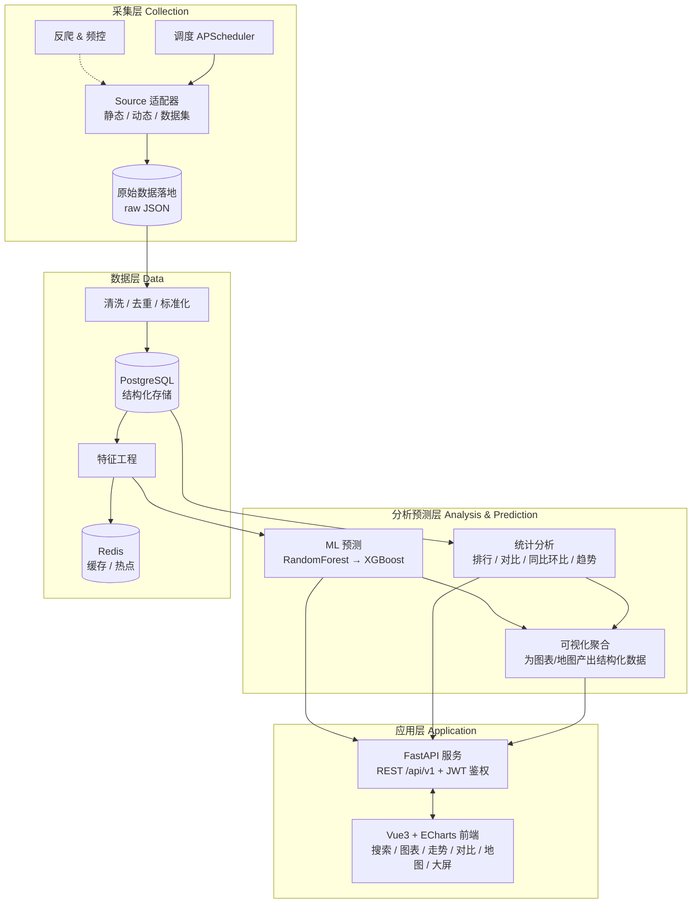
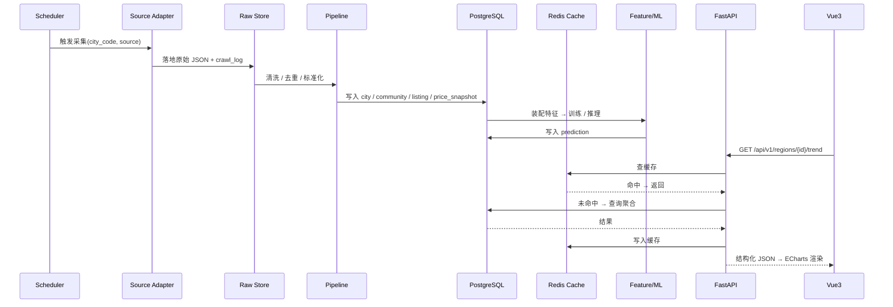
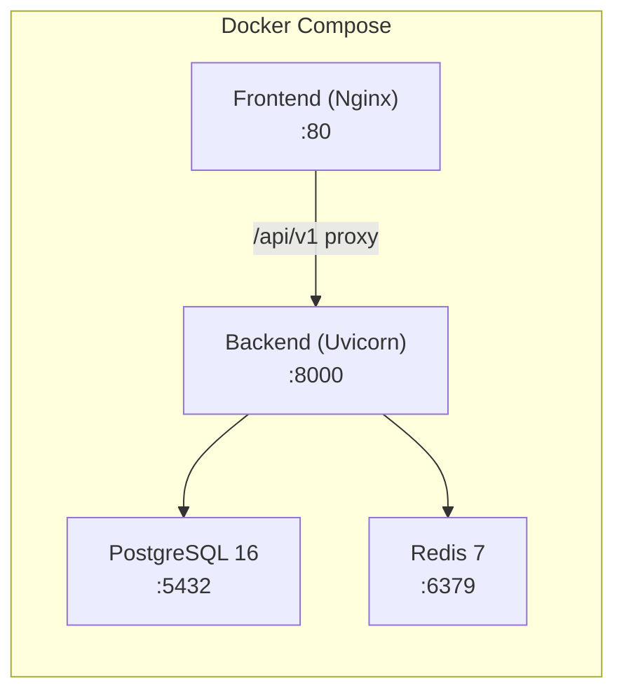

# 02 · 系统架构设计

> 本文档描述系统四层架构、模块边界、关键数据流、部署拓扑与统一术语表。

## 1. 架构总览

系统采用**自底向上四层架构**：采集层 → 数据层 → 分析预测层 → 应用层。层间通过数据库与内部函数调用解耦，采集层与查询/分析解耦——采集挂掉不影响既有数据的查询。

## 2. 各层职责

### 2.1 采集层（L1 Collection）

- **调度器**：APScheduler，支持 cron 定时与手动触发。
- **Source 适配器**：统一接口 `BaseSource`，三类实现——静态源（requests+lxml）、动态源（Playwright）、数据集导入（CSV/Parquet）。
- **反爬与频控**：随机延时、UA 轮换、请求频率上限。
- **原始数据落地**：采集结果先以 JSON 存入 `data/raw/`，再由 pipeline 消费。

### 2.2 数据层（L2 Data）

- **清洗管线**：字段标准化（价格→整数元/㎡，日期→YYYY-MM，面积→float ㎡）、异常值过滤、去重（源+源ID 或 区域+时间）。
- **PostgreSQL**：持久化结构化数据，利用窗口函数做同环比计算。
- **Redis**：缓存热点查询（均价、走势），TTL 按数据更新频率设定。
- **特征工程**：滞后价格（lag-1/3/6/12）、滚动均值、同比环比变化率、区域 one-hot。

### 2.3 分析预测层（L3 Analysis & Prediction）

- **统计分析**：排行、多区域对比、同比环比、价格分布——均为 SQL + Pandas 聚合。
- **ML 预测**：RandomForest（基线）→ XGBoost（提升），scikit-learn 标准流程。
- **可视化聚合**：将分析/预测结果转为前端可直接消费的结构化 JSON。

### 2.4 应用层（L4 Application）

- **FastAPI**：REST API（`/api/v1`），Pydantic v2 校验，依赖注入鉴权。
- **Vue3 前端**：Vite 构建，Pinia 状态管理，Element Plus 组件库，ECharts 图表（含 geo 离线 GeoJSON）。

## 3. 模块与目录映射

| 模块 | 目录 | 职责 | 关键依赖 |
|------|------|------|---------|
| collector | `backend/app/collector/` | 调度、Source 适配器、反爬、原始落地 | requests, lxml, playwright, apscheduler |
| pipeline | `backend/app/pipeline/` | 清洗、去重、标准化、入库、特征工程 | pandas, sqlalchemy, alembic |
| analytics | `backend/app/analytics/` | 排行、对比、趋势、同比环比、聚合 | pandas, numpy |
| ml | `backend/app/ml/` | 特征装配、训练、评估、推理、模型版本化 | scikit-learn, xgboost, joblib |
| api | `backend/app/api/` | REST 路由、依赖注入、鉴权、序列化 | fastapi, pydantic v2, python-jose |
| core | `backend/app/core/` | 配置、DB 会话、缓存、日志、安全 | pydantic-settings, redis |
| frontend | `frontend/` | 页面、组件、图表、地图、状态管理 | vue3, vite, ts, element-plus, echarts, pinia |

## 4. 组件交互图

## 5. 部署拓扑

- **开发环境**：`docker-compose.yml` 一键启动四个服务。
- **生产环境**：Nginx 反代前端静态资源 + API 代理，可水平扩展 Backend 实例。

## 附录 A · 术语表

| 术语 | 英文标识 | 说明 |
|------|---------|------|
| 城市 | city | 行政级城市，拼音缩写作为 code（如泉州 → `qz`） |
| 区县 | district | 城市下辖行政区/县（如丰泽区） |
| 街镇/板块 | area | 区县下辖街道/镇/板块 |
| 小区 | community | 住宅小区，最细粒度地理实体 |
| 房源 | listing | 某小区内的一套在售房源 |
| 均价快照 | price_snapshot | 某区域某月的均价记录，含三口径 |
| 供给价 | supply_price | 卖方挂牌均价 |
| 关注价 | attention_price | 买方关注/搜索热度加权均价 |
| 价值价 | value_price | 平台评估参考均价 |
| 价格分布 | price_distribution | 某区域内价格区间占比 |
| 预测 | prediction | ML 模型输出的未来均价预测值 |
| 采集任务 | crawl_job | 一次完整的数据采集执行 |
| 采集日志 | crawl_log | 单个 URL 的采集结果记录 |
| 数据源 | source | 数据来源标识（creprice / lianjia / anjuke / kaggle） |
| 区域类型 | region_type | 统一区域粒度标识：city / district / area |
