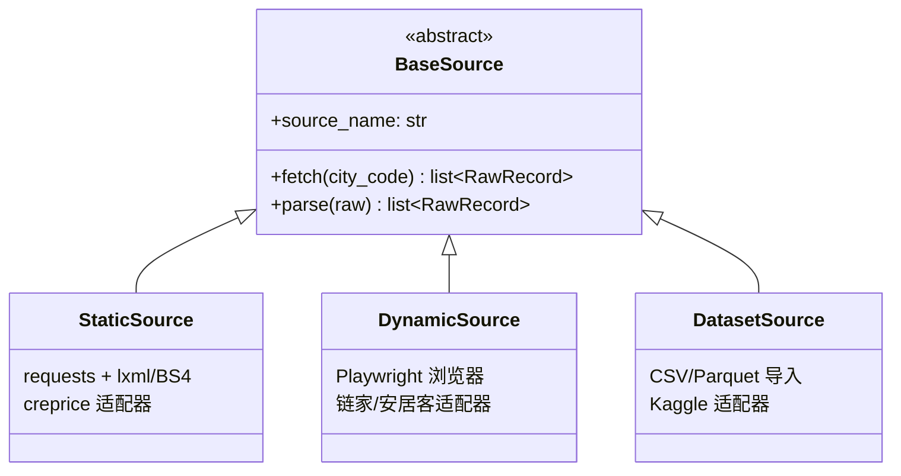
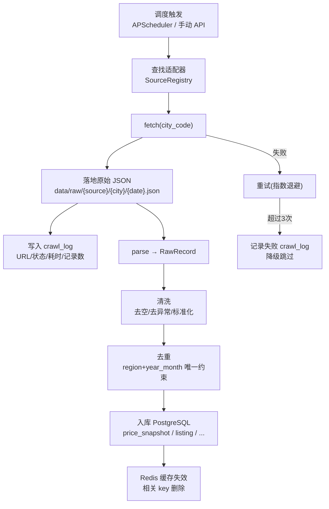

# 03 · 数据采集设计

> 本文档描述数据源画像、Source 适配器架构、反爬策略、字段映射与采集流水线。

## 1. 数据源画像

### 1.1 主力源：中国房价行情（creprice.cn）

| 维度 | 说明 |
|------|------|
| 定位 | **主力真实数据源** |
| 可访问性 | 正常访问，无登录墙 |
| 反爬强度 | 弱——SSR HTML table 直出，requests 即可 |
| 数据粒度 | 城市/区县/街镇级，月度历史时序 |
| 数据内容 | 供给价、关注价、价值价（元/㎡）；价格区间分布 |
| 加载方式 | SSR（`<table>` 直出） |
| URL 规则 | `/urban/{cityPinyinAbbr}.html`（如泉州 `/urban/qz.html`）<br/>`/rank/citySel.html`（城市列表）<br/>`/web/halist/{city}.html`（小区列表） |
| 历史深度 | 自 2005 年起，超 20 年月度数据 |

### 1.2 演示源：链家（lianjia.com）

| 维度 | 说明 |
|------|------|
| 定位 | 演示级，展示多源能力 |
| 反爬强度 | 极强——裸请求 Forbidden，需浏览器指纹+登录态 |
| 数据粒度 | 小区/房源级明细 |
| 采集方式 | Playwright，小样本低频 |

### 1.3 演示源：安居客（anjuke.com）

| 维度 | 说明 |
|------|------|
| 定位 | 演示级，展示反爬处理能力 |
| 反爬强度 | 极强——58 antibot 滑块验证 |
| 数据粒度 | 小区/房源级明细 |
| 采集方式 | Playwright，小样本低频 |

### 1.4 数据集：Kaggle / 公开数据

| 维度 | 说明 |
|------|------|
| 定位 | ML 建模底座 |
| 内容 | Kaggle House Prices 数据集；国家统计局 70 城房价指数（可选） |
| 导入方式 | CSV/Parquet 直接导入 |

## 2. Source 适配器架构

### 2.1 统一接口

```python
class BaseSource(ABC):
    source_name: str  # 数据源标识

    @abstractmethod
    async def fetch(self, city_code: str, **kwargs) -> list[RawRecord]:
        """采集指定城市的原始数据"""
        ...

    @abstractmethod
    def parse(self, raw_html: str | bytes) -> list[RawRecord]:
        """解析原始内容为标准化记录"""
        ...
```

### 2.2 三类适配器



| 适配器类型 | 实现 | 适用数据源 |
|-----------|------|-----------|
| StaticSource | requests + lxml / BeautifulSoup | creprice.cn |
| DynamicSource | Playwright (chromium) | 链家、安居客 |
| DatasetSource | pandas read_csv / read_parquet | Kaggle 等 |

### 2.3 适配器注册

适配器通过 `SourceRegistry` 注册，调度器按 `(source_name, city_code)` 查找适配器实例：

```python
registry = SourceRegistry()
registry.register("creprice", CrepriceSource())
registry.register("lianjia", LianjiaSource())
```

## 3. creprice 字段映射

### 3.1 均价时序表（`/urban/{city}.html`）

| HTML 表头 | 标准字段 | 类型 | 说明 |
|-----------|---------|------|------|
| 时间 | year_month | str `YYYY-MM` | 月度维度 |
| 供给(元/㎡) | supply_price | int | 去逗号，转整数 |
| 关注(元/㎡) | attention_price | int \| null | `--` → null |
| 价值(元/㎡) | value_price | int | 去逗号，转整数 |

### 3.2 价格分布表

| HTML 表头 | 标准字段 | 类型 |
|-----------|---------|------|
| 价格区间 | price_range_low / price_range_high | int |
| 占比 | percentage | float (0~100) |

### 3.3 区县列表

从城市页面解析区县链接，提取 district name 与 URL path。

## 4. 反爬策略

| 策略 | 实现 | 适用 |
|------|------|------|
| 请求延时 | `asyncio.sleep(random.uniform(1, 3))` | 所有源 |
| UA 轮换 | 从预置列表随机选取 User-Agent | 所有源 |
| 频率上限 | 单源单城市每分钟 ≤ 10 请求 | 所有源 |
| 重试退避 | 4xx/5xx 指数退避重试（最多 3 次） | 所有源 |
| 降级跳过 | 中介站连续失败自动跳过，不阻塞主力源 | 链家/安居客 |
| Playwright 指纹 | stealth 模式、随机 viewport | 动态源 |

## 5. 采集流水线



## 6. 调度策略

| 任务类型 | 频率 | 说明 |
|---------|------|------|
| creprice 全量 | 每月 1 日 02:00 | 月度数据更新后采集 |
| creprice 增量 | 每周日 03:00 | 检查是否有新月份数据 |
| 链家/安居客 | 手动触发 | 演示用，按需小批量 |
| 数据集导入 | 手动触发 | 一次性或按需更新 |

## 7. 原始数据存储

```
data/
  raw/
    creprice/
      qz/
        2026-07-06.json
    lianjia/
      qz/
        2026-07-06.json
```

每次采集保留完整原始响应，便于：
- 回溯排查数据质量问题
- 站点结构变更时用历史数据重跑解析
- 不丢失任何采集到的信息
