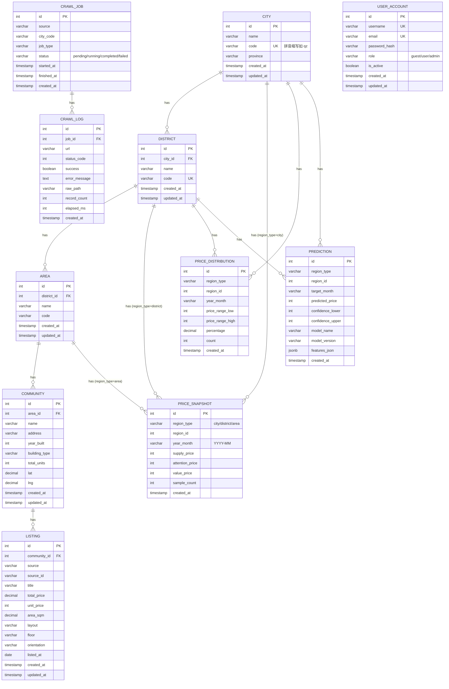

> **⚠️ 本文档为早期规划产出，内容不再维护，可能与当前实现存在差异。请以实际代码为准。**

# 04 · 数据模型与数据库设计

> 本文档为数据库设计的**单一事实源**。改动表结构须先改本文档，再改代码。

## 1. ER 图



## 2. 建表 DDL

### 2.1 地理维度表

```sql
CREATE TABLE city (
    id            SERIAL PRIMARY KEY,
    name          VARCHAR(50)  NOT NULL,
    code          VARCHAR(20)  NOT NULL UNIQUE,  -- 拼音缩写
    province      VARCHAR(50),
    created_at    TIMESTAMPTZ  NOT NULL DEFAULT NOW(),
    updated_at    TIMESTAMPTZ  NOT NULL DEFAULT NOW()
);

CREATE TABLE district (
    id            SERIAL PRIMARY KEY,
    city_id       INTEGER      NOT NULL REFERENCES city(id),
    name          VARCHAR(50)  NOT NULL,
    code          VARCHAR(30)  NOT NULL UNIQUE,
    created_at    TIMESTAMPTZ  NOT NULL DEFAULT NOW(),
    updated_at    TIMESTAMPTZ  NOT NULL DEFAULT NOW()
);

CREATE TABLE area (
    id            SERIAL PRIMARY KEY,
    district_id   INTEGER      NOT NULL REFERENCES district(id),
    name          VARCHAR(50)  NOT NULL,
    code          VARCHAR(30),
    created_at    TIMESTAMPTZ  NOT NULL DEFAULT NOW(),
    updated_at    TIMESTAMPTZ  NOT NULL DEFAULT NOW()
);

CREATE TABLE community (
    id            SERIAL PRIMARY KEY,
    area_id       INTEGER      NOT NULL REFERENCES area(id),
    name          VARCHAR(100) NOT NULL,
    address       VARCHAR(200),
    year_built    SMALLINT,
    building_type VARCHAR(30),
    total_units   INTEGER,
    lat           NUMERIC(10,7),
    lng           NUMERIC(10,7),
    created_at    TIMESTAMPTZ  NOT NULL DEFAULT NOW(),
    updated_at    TIMESTAMPTZ  NOT NULL DEFAULT NOW()
);
```

### 2.2 房源表

```sql
CREATE TABLE listing (
    id            SERIAL PRIMARY KEY,
    community_id  INTEGER      NOT NULL REFERENCES community(id),
    source        VARCHAR(20)  NOT NULL,   -- creprice / lianjia / anjuke
    source_id     VARCHAR(50),             -- 数据源端原始ID
    title         VARCHAR(200),
    total_price   NUMERIC(12,2),           -- 万元
    unit_price    INTEGER,                 -- 元/㎡
    area_sqm      NUMERIC(8,2),
    layout        VARCHAR(30),             -- 如 3室2厅
    floor         VARCHAR(30),
    orientation   VARCHAR(30),
    listed_at     DATE,
    created_at    TIMESTAMPTZ  NOT NULL DEFAULT NOW(),
    updated_at    TIMESTAMPTZ  NOT NULL DEFAULT NOW(),
    UNIQUE(source, source_id)
);
```

### 2.3 均价快照表

```sql
CREATE TABLE price_snapshot (
    id              SERIAL PRIMARY KEY,
    region_type     VARCHAR(10)  NOT NULL,  -- city / district / area
    region_id       INTEGER      NOT NULL,
    year_month      VARCHAR(7)   NOT NULL,  -- YYYY-MM
    supply_price    INTEGER,                -- 供给均价 元/㎡
    attention_price INTEGER,                -- 关注均价
    value_price     INTEGER,                -- 价值均价
    sample_count    INTEGER,
    created_at      TIMESTAMPTZ  NOT NULL DEFAULT NOW(),
    UNIQUE(region_type, region_id, year_month)
);

CREATE INDEX idx_price_snapshot_region ON price_snapshot(region_type, region_id);
CREATE INDEX idx_price_snapshot_month  ON price_snapshot(year_month);
```

### 2.4 价格分布表

```sql
CREATE TABLE price_distribution (
    id              SERIAL PRIMARY KEY,
    region_type     VARCHAR(10)  NOT NULL,
    region_id       INTEGER      NOT NULL,
    year_month      VARCHAR(7)   NOT NULL,
    price_range_low  INTEGER     NOT NULL,
    price_range_high INTEGER     NOT NULL,
    percentage      NUMERIC(5,2),           -- 0.00 ~ 100.00
    count           INTEGER,
    created_at      TIMESTAMPTZ  NOT NULL DEFAULT NOW(),
    UNIQUE(region_type, region_id, year_month, price_range_low)
);
```

### 2.5 预测结果表

```sql
CREATE TABLE prediction (
    id               SERIAL PRIMARY KEY,
    region_type      VARCHAR(10)  NOT NULL,
    region_id        INTEGER      NOT NULL,
    target_month     VARCHAR(7)   NOT NULL,  -- 预测目标月份
    predicted_price  INTEGER      NOT NULL,
    confidence_lower INTEGER,
    confidence_upper INTEGER,
    model_name       VARCHAR(50)  NOT NULL,  -- random_forest / xgboost
    model_version    VARCHAR(20)  NOT NULL,
    features_json    JSONB,
    created_at       TIMESTAMPTZ  NOT NULL DEFAULT NOW(),
    UNIQUE(region_type, region_id, target_month, model_name, model_version)
);
```

### 2.6 用户表

```sql
CREATE TABLE user_account (
    id            SERIAL PRIMARY KEY,
    username      VARCHAR(50)  NOT NULL UNIQUE,
    email         VARCHAR(100) NOT NULL UNIQUE,
    password_hash VARCHAR(128) NOT NULL,
    role          VARCHAR(10)  NOT NULL DEFAULT 'user',  -- guest / user / admin
    is_active     BOOLEAN      NOT NULL DEFAULT TRUE,
    created_at    TIMESTAMPTZ  NOT NULL DEFAULT NOW(),
    updated_at    TIMESTAMPTZ  NOT NULL DEFAULT NOW()
);
```

### 2.7 采集管理表

```sql
CREATE TABLE crawl_job (
    id            SERIAL PRIMARY KEY,
    source        VARCHAR(20)  NOT NULL,
    city_code     VARCHAR(20)  NOT NULL,
    job_type      VARCHAR(20)  NOT NULL,   -- full / incremental
    status        VARCHAR(20)  NOT NULL DEFAULT 'pending',  -- pending/running/completed/failed
    started_at    TIMESTAMPTZ,
    finished_at   TIMESTAMPTZ,
    created_at    TIMESTAMPTZ  NOT NULL DEFAULT NOW()
);

CREATE TABLE crawl_log (
    id            SERIAL PRIMARY KEY,
    job_id        INTEGER      NOT NULL REFERENCES crawl_job(id),
    url           VARCHAR(500) NOT NULL,
    status_code   SMALLINT,
    success       BOOLEAN      NOT NULL,
    error_message TEXT,
    raw_path      VARCHAR(300),
    record_count  INTEGER      DEFAULT 0,
    elapsed_ms    INTEGER,
    created_at    TIMESTAMPTZ  NOT NULL DEFAULT NOW()
);

CREATE INDEX idx_crawl_log_job ON crawl_log(job_id);
```

## 3. 索引策略

| 表 | 索引 | 类型 | 用途 |
|----|------|------|------|
| city | code (UNIQUE) | B-tree | 按拼音缩写查城市 |
| district | city_id + name | B-tree | 按城市查区县 |
| price_snapshot | (region_type, region_id) | B-tree | 按区域查均价 |
| price_snapshot | year_month | B-tree | 按时间范围过滤 |
| price_snapshot | (region_type, region_id, year_month) UNIQUE | B-tree | 去重约束 |
| listing | (source, source_id) UNIQUE | B-tree | 数据源去重 |
| prediction | (region_type, region_id, target_month) | B-tree | 查预测结果 |
| crawl_log | job_id | B-tree | 按任务查日志 |
| user_account | username / email (UNIQUE) | B-tree | 登录查询 |

## 4. 迁移策略

- **工具**：Alembic（SQLAlchemy 迁移框架）。
- **初始迁移**：`alembic revision --autogenerate -m "init schema"` 生成全表。
- **增量迁移**：每次表结构变更先修改本文档，再修改 SQLAlchemy 模型，最后 `alembic revision --autogenerate`。
- **回滚**：`alembic downgrade -1` 可回退上一版本。
- **约定**：
  - 所有表使用 `TIMESTAMPTZ`（带时区）。
  - 主键统一 `SERIAL`（自增整数）。
  - 外键命名：`{子表}_{字段}_fkey`。
  - 表名小写下划线，与 SQLAlchemy 模型类名对应。

## 5. Redis 缓存设计

| Key 模式 | 值 | TTL | 失效时机 |
|---------|-----|-----|---------|
| `price:{region_type}:{region_id}:latest` | 最新均价 JSON | 1h | 新数据入库 |
| `trend:{region_type}:{region_id}:{months}` | 走势数组 JSON | 1h | 新数据入库 |
| `rank:{region_type}:{sort}:{page}` | 排行列表 JSON | 30min | 新数据入库 |
| `predict:{region_type}:{region_id}` | 预测结果 JSON | 24h | 模型重训 |
