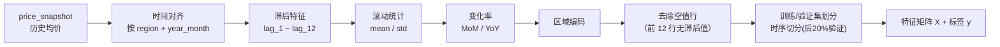
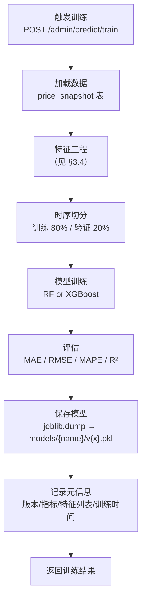
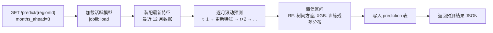

> **⚠️ 本文档为早期规划产出，内容不再维护，可能与当前实现存在差异。请以实际代码为准。**

# 06 · 机器学习预测设计

> 本文档描述特征工程、模型选型、训练/评估流程、模型版本化与推理服务。

## 1. 预测目标

**回归任务**：给定某区域的历史月度均价时序及衍生特征，预测未来 1~3 个月的均价（元/㎡）。

## 2. 数据来源

| 数据集 | 用途 | 说明 |
|-------|------|------|
| price_snapshot | 训练主力 | 真实历史月度均价（creprice 采集） |
| Kaggle House Prices | 建模验证 | 验证回归范式与特征工程方法，不直接用于生产预测 |
| 国家统计局 70 城指数 | 补充特征（可选） | 宏观市场指标 |

## 3. 特征工程

### 3.1 基础特征

| 特征名 | 来源 | 说明 |
|-------|------|------|
| supply_price | price_snapshot | 当月供给均价 |
| attention_price | price_snapshot | 当月关注均价 |
| value_price | price_snapshot | 当月价值均价 |

### 3.2 时序衍生特征

| 特征名 | 计算方式 | 说明 |
|-------|---------|------|
| lag_1 ~ lag_12 | supply_price 滞后 1~12 期 | 历史价格信号 |
| rolling_mean_3 | 最近 3 个月滚动均值 | 短期趋势 |
| rolling_mean_6 | 最近 6 个月滚动均值 | 中期趋势 |
| rolling_mean_12 | 最近 12 个月滚动均值 | 长期趋势 |
| rolling_std_6 | 最近 6 个月滚动标准差 | 波动度 |
| mom_pct | (当月 - 上月) / 上月 × 100 | 环比变化率 |
| yoy_pct | (当月 - 去年同月) / 去年同月 × 100 | 同比变化率 |
| month | 从 year_month 提取月份 | 季节性信号 |
| quarter | 从 year_month 提取季度 | 季节性信号 |

### 3.3 区域特征

| 特征名 | 说明 |
|-------|------|
| region_type_enc | region_type 编码（city=0, district=1, area=2） |
| city_code_enc | 城市 one-hot 或 label 编码 |

### 3.4 特征装配流程



## 4. 模型选型

### 4.1 基线：RandomForest

| 配置 | 值 |
|------|-----|
| 模型 | `sklearn.ensemble.RandomForestRegressor` |
| n_estimators | 100 |
| max_depth | 10 |
| min_samples_split | 5 |
| random_state | 42 |
| 优势 | 稳健、无需大量调参、不易过拟合、可解释（feature_importances_） |

### 4.2 提升项：XGBoost

| 配置 | 值 |
|------|-----|
| 模型 | `xgboost.XGBRegressor` |
| n_estimators | 200 |
| max_depth | 6 |
| learning_rate | 0.1 |
| subsample | 0.8 |
| colsample_bytree | 0.8 |
| 优势 | 更高精度、梯度提升可捕捉非线性关系 |

### 4.3 模型对比

两个模型在相同特征与验证集上评估，保留两个模型权重，API 层支持切换活跃模型。

## 5. 训练流程



## 6. 评估指标

| 指标 | 公式 | 达标线 |
|------|------|--------|
| MAE | 平均绝对误差 | ≤ 500 元/㎡ |
| RMSE | 均方根误差 | ≤ 800 元/㎡ |
| MAPE | 平均绝对百分比误差 | ≤ 5% |
| R² | 决定系数 | ≥ 0.85 |

达标线为参考目标，真实数据积累后调整。

## 7. 推理流程



### 滚动预测说明

预测 t+1 后，将预测值作为 lag_1 代入，shift 其他滞后特征，预测 t+2，以此类推。置信区间：

- **RandomForest**：利用各棵树的预测值计算均值±1.96×标准差。
- **XGBoost**：基于验证集残差分布的分位数。

## 8. 模型版本化

### 8.1 存储结构

```
models/
  random_forest/
    v1.0.pkl
    v1.0_meta.json
    v1.1.pkl
    v1.1_meta.json
  xgboost/
    v1.0.pkl
    v1.0_meta.json
```

### 8.2 元信息文件（meta.json）

```json
{
  "model_name": "random_forest",
  "version": "v1.0",
  "trained_at": "2026-07-01T10:00:00Z",
  "features": ["lag_1", "lag_3", "rolling_mean_6", "mom_pct", "..."],
  "metrics": {
    "mae": 420,
    "rmse": 650,
    "mape": 3.2,
    "r2": 0.91
  },
  "training_samples": 1200,
  "city_codes": ["qz"]
}
```

### 8.3 版本切换

管理员通过 API 或配置指定活跃模型版本。切换即时生效，旧版本保留可回退。

## 9. 数据不足处理

| 场景 | 处理 |
|------|------|
| 历史数据 < 24 个月 | 使用可用数据训练，日志警告，预测结果标注"数据积累中" |
| 历史数据 < 12 个月 | 不生成预测，API 返回 `PREDICTION_NOT_AVAILABLE`、message "数据不足" |
| 某月缺失 | 线性插值填充，缺失率 > 30% 则跳过该区域 |
