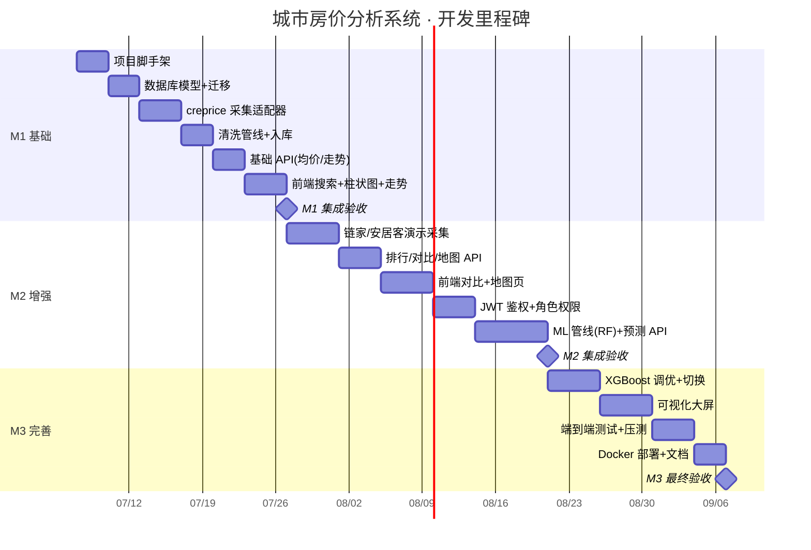

> **⚠️ 本文档为早期规划产出，内容不再维护，可能与当前实现存在差异。请以实际代码为准。**

# 08 · 开发计划与里程碑

> 本文档定义三阶段开发计划、任务分解、排期与验收口径。

## 1. 阶段概览

| 阶段 | 代号 | 周期 | 核心目标 |
|------|------|------|---------|
| M1 | 基础 | 第 1 个月 | 脚手架 + 采集(creprice) + 清洗入库 + 基础查询/图表 |
| M2 | 增强 | 第 2~3 个月 | 对比 + 地图 + 权限 + 预测链路(RF) |
| M3 | 完善 | 第 3 个月后 | XGBoost 调优 + 大屏 + 测试 + 部署 |

## 2. M1 · 基础（第 1 个月）

### 2.1 任务分解

| 编号 | 任务 | 交付物 | 预估 |
|------|------|--------|------|
| M1-1 | 项目脚手架 | `backend/`、`frontend/`、`docker-compose.yml`、CI 配置、健康检查端点 `GET /health` | 3d |
| M1-2 | 数据库模型 + 迁移 | SQLAlchemy 模型（对应 [04](./04-数据模型与数据库设计.md) 全部表）、Alembic 初始迁移 | 3d |
| M1-3 | creprice 采集适配器 | `CrepriceSource` 实现、APScheduler 调度、原始 JSON 落地、crawl_log 写入 | 4d |
| M1-4 | 清洗管线 + 入库 | 清洗/去重/标准化 pipeline、price_snapshot/city/district 入库、单元测试 | 3d |
| M1-5 | 基础 API | `GET /cities`、`GET /cities/{code}/districts`、`GET /regions/{id}/price`、`GET /regions/{id}/trend` | 3d |
| M1-6 | 前端基础页面 | 首页搜索、城市概览（柱状图）、区县走势（折线图）| 4d |

### 2.2 验收标准

- [ ] `docker-compose up` 一键启动 PostgreSQL + Redis + Backend + Frontend
- [ ] 触发 creprice 泉州采集 → 原始 JSON 落地 → 清洗入库成功
- [ ] API 可查到泉州及其区县均价、≥12 个月走势数据
- [ ] 前端搜索泉州 → 显示区县柱状图 → 点击区县 → 显示走势折线图
- [ ] crawl_log 正确记录采集 URL、状态、耗时

## 3. M2 · 增强（第 2~3 个月）

### 3.1 任务分解

| 编号 | 任务 | 交付物 | 预估 |
|------|------|--------|------|
| M2-1 | 演示级采集适配器 | `LianjiaSource`、`AnjukeSource`（Playwright，小样本）、反爬处理 | 5d |
| M2-2 | 排行/对比/地图 API | `GET /rank`、`GET /compare`、`GET /map/heat`、Redis 缓存 | 4d |
| M2-3 | 前端对比 + 地图 | CompareView（多区域走势叠加）、MapView（ECharts geo 热力）| 5d |
| M2-4 | 鉴权 + 权限 | JWT 登录注册、三角色权限、路由守卫、管理后台雏形 | 4d |
| M2-5 | ML 管线 + 预测 | 特征工程、RandomForest 训练/评估、推理 API、prediction 表、PredictView | 7d |

### 3.2 验收标准

- [ ] 链家/安居客各采集到 ≥ 5 条小区/房源样本
- [ ] 排行榜：全市区县按均价排序正确
- [ ] 多区域对比：选 2~3 区县走势叠加显示
- [ ] 地图：泉州各区县着色热力图，点击可下钻
- [ ] 权限：游客/用户/管理员访问范围符合 [01](./01-需求规格说明.md) 定义
- [ ] 预测：泉州 ≥ 1 个区县生成 3 个月预测值，含置信区间
- [ ] RF 模型 R² ≥ 0.80（真实数据不足时用 Kaggle 数据集验证链路）

## 4. M3 · 完善（第 3 个月后）

### 4.1 任务分解

| 编号 | 任务 | 交付物 | 预估 |
|------|------|--------|------|
| M3-1 | XGBoost 调优 | XGBoost 训练、交叉验证、模型对比、版本切换 API | 5d |
| M3-2 | 可视化大屏 | DashboardView 多图联动（走势+排行+分布+地图） | 5d |
| M3-3 | 测试 + 加固 | 端到端测试（Playwright E2E）、错误处理、日志、压测 | 4d |
| M3-4 | 部署 + 文档 | Docker 镜像、docker-compose 生产配置、部署文档更新 | 3d |

### 4.2 验收标准

- [ ] XGBoost 精度 ≥ RF（MAPE 对比）
- [ ] 大屏页面多图联动：点选区域 → 各图表同步切换
- [ ] 关键路径单元测试覆盖率 ≥ 70%
- [ ] Docker 镜像构建成功，`docker compose -f docker-compose.yml --env-file .env.prod up` 可运行（compose 已收敛为基准+override 结构）
- [ ] 全流程端到端通过：采集 → 入库 → 查询 → 图表 → 预测

## 5. 风险与应对

| 风险 | 影响 | 应对 |
|------|------|------|
| creprice 站点结构变更 | 采集中断 | 字段映射配置化，解析失败降级记录日志 |
| 真实数据不足以训练 ML | 预测精度差 | 先用公开数据集验证链路，真实数据增量积累 |
| 链家/安居客反爬升级 | 演示采集失败 | 降级为演示级（硬编码样本数据），不影响主链路 |
| 前端 GeoJSON 缺失 | 地图渲染失败 | 提前收集并内置所有目标城市的 GeoJSON |

## 6. 首个打通城市

**泉州（qz）**——creprice 覆盖好、实测通过。全部 M1/M2 验收均以泉州为基准城市。后续横向扩展只需配置 `city_code`。
